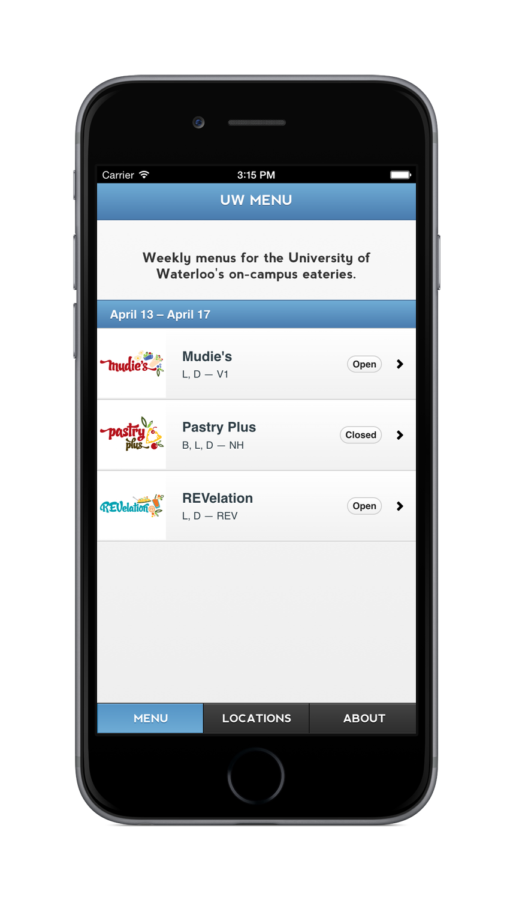
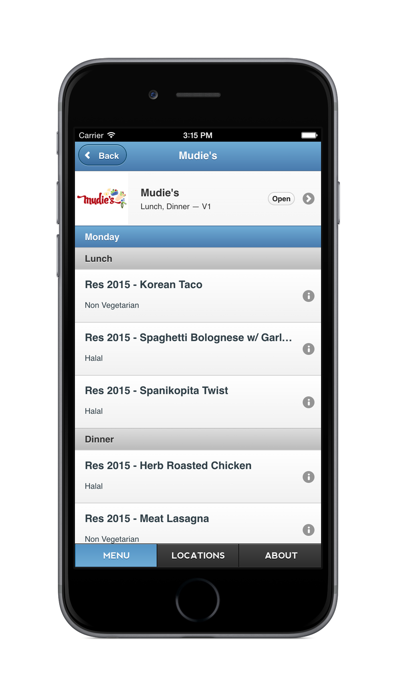
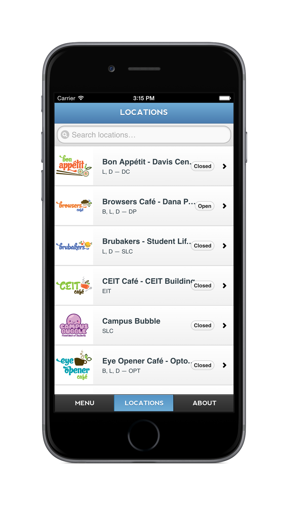
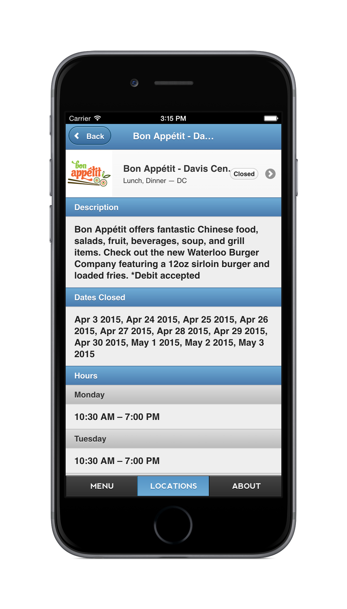
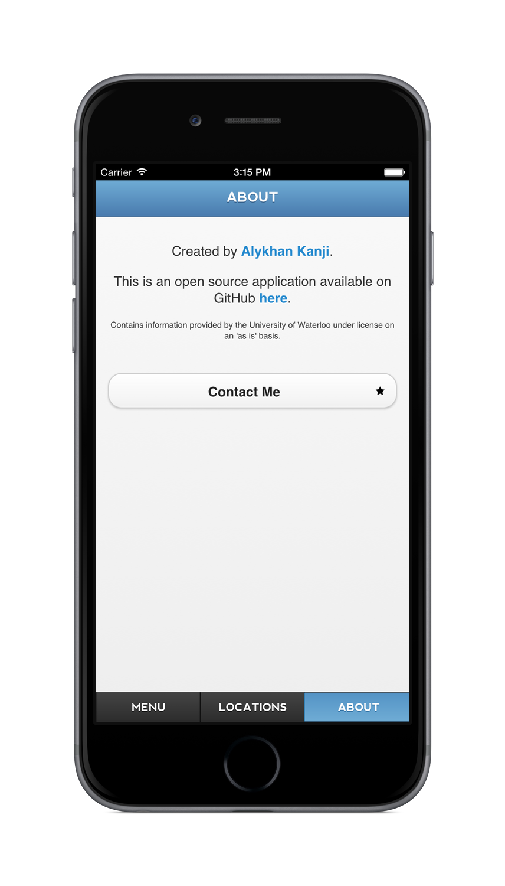

# [UW Menu](http://uwmenu.com)

[](https://travis-ci.org/alykhank/FoodMenu)
[](https://gemnasium.com/alykhank/FoodMenu)
[](https://coveralls.io/github/alykhank/FoodMenu?branch=master)
[](https://codeclimate.com/github/alykhank/FoodMenu)

* See meals for the week at each on-campus eatery, including nutrition facts
* Browse locations and hours for eateries









## Technologies

* Hosted on [Heroku](https://www.heroku.com)
* Retrieves JSON data from the [University of Waterloo Open Data API](https://api.uwaterloo.ca)
* Caches some data using [Redis](http://redis.io)
* Parses and displays data via [Flask](http://flask.pocoo.org) with [Jinja](http://jinja.pocoo.org)
* Uses [jQuery Mobile](https://jquerymobile.com) for interface

## Development

* Prerequisites:
  * Ensure [pip](https://pip.pypa.io/en/stable/), [Virtualenv](https://virtualenv.pypa.io/en/latest/), and [Heroku Toolbelt](https://toolbelt.heroku.com) are installed
  * [Redis](http://redis.io) will be installed via [Homebrew](http://brew.sh) if it is not already
* [Request a key](https://api.uwaterloo.ca/apikey/) for the UW Open Data API

```bash
script/bootstrap
script/run
open http://localhost:5000/
```

## Tests

```bash
script/test
```
